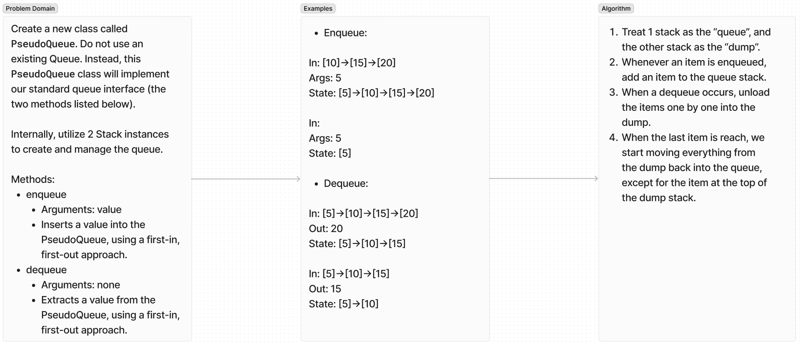

# Pseudo Queue

Write a class PseudoQueue that emulates a queue with enqueue and dequeue methods, but built with 2 stacks.

## Whiteboard Process

## Approach & Efficiency

The forced solution, due to having to use two stacks, was to juggle the data between the stacks when dequeueing an item. This method results in O(N).

## Solution

## Contributions

All tests were written using OpenAI's ChatGPT 4o. A link to the instance that generated these tests can be found here:

