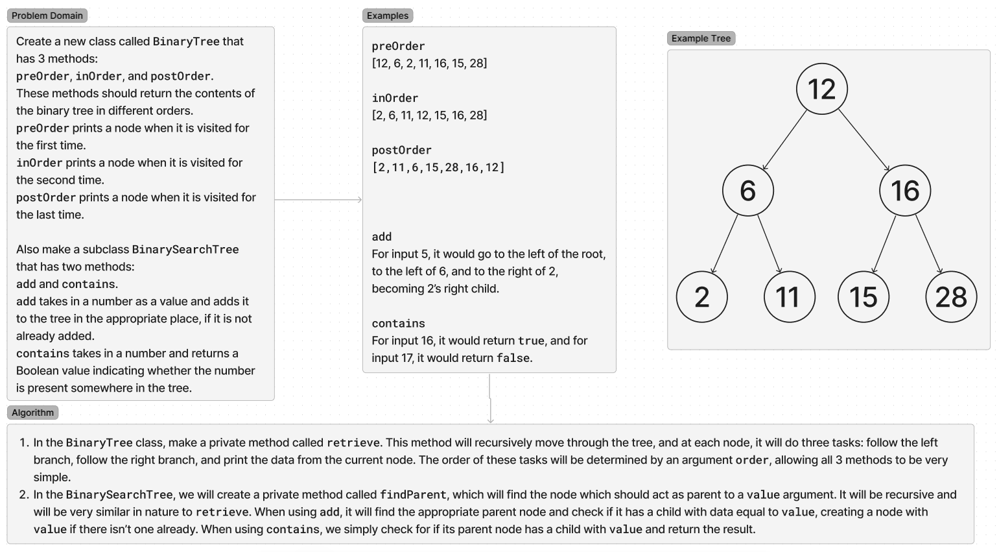

# Trees

Write a BinaryTree and BinarySearchTree class.

## Whiteboard Process

## Approach & Efficiency

The methods for the BinaryTree class all have efficiency of O(N). The methods for the BinarySearchTree class both have O(logN)

## Solution

## Contributions

All tests were written using OpenAI's ChatGPT 4o.
