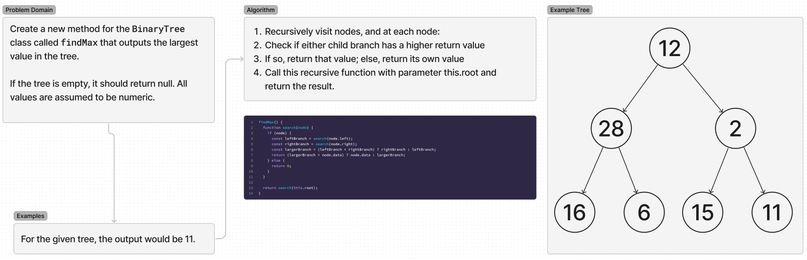

# Trees

Write a BinaryTree method that finds the largest value in the tree.

## Whiteboard Process

## Approach & Efficiency

I used a recursive function which visits every node exactly once, making the efficiency O(N).

## Solution

## Contributions

All tests were written using OpenAI's ChatGPT 4o.
