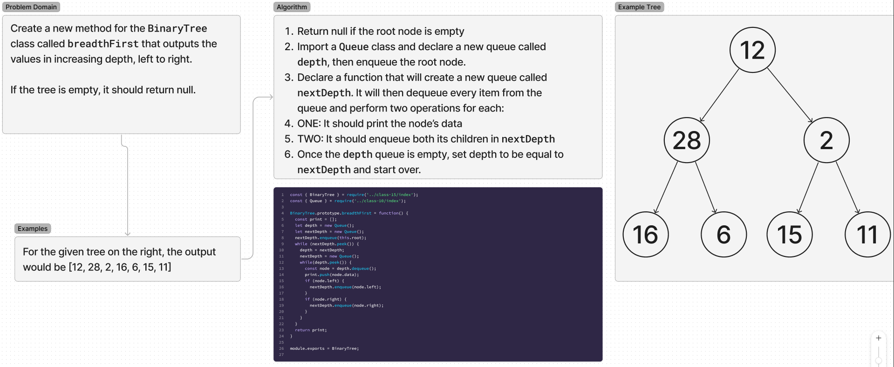

# Trees

Write a BinaryTree method that prints out the tree in breadth-first order.

## Whiteboard Process

## Approach & Efficiency

I used queues to save children nodes while iterating through the previous depth. This results in each node only being visited once, making this O(N).

## Solution

## Contributions

All tests were written using OpenAI's ChatGPT 4o.
