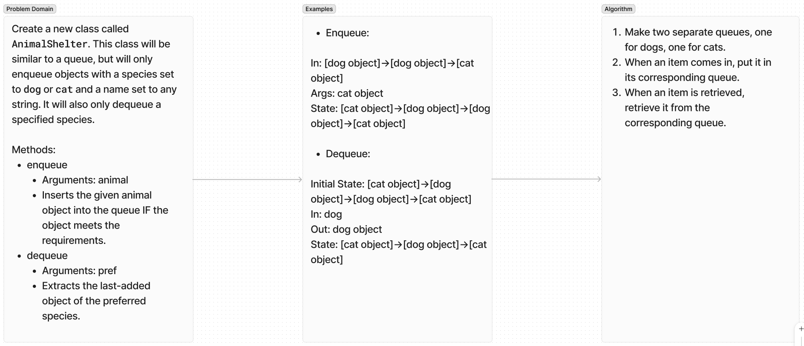

# Pseudo Queue

Write a class AnimalShelter that is for the most part a Queue, but only enqueues two different categories of objects and dequeues these categories seperately.

## Whiteboard Process

## Approach & Efficiency

For my solution I used two queues working within the one class, which gives an efficiency of O(N), the same as the individual queues.

## Solution

## Contributions

All tests were written using OpenAI's ChatGPT 4o. A link to the instance that generated these tests can be found here:

