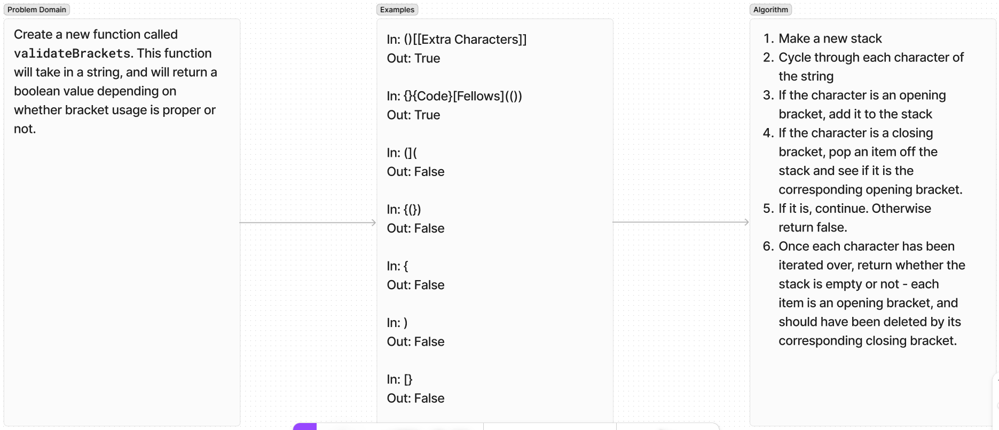

# Pseudo Queue

Write a function validateBrackets that takes in a string and responds with a Boolean value indicating whether or not it utilizes brackets properly.

## Whiteboard Process

## Approach & Efficiency

For my solution I made a stack that kept a history of opening brackets as the string was iterated through, and deleted the top item whenever its corresponding closing bracket was found. This has O(N).

## Solution

## Contributions

All tests were written using OpenAI's ChatGPT 4o.
